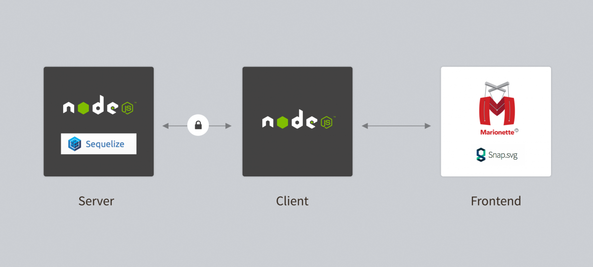
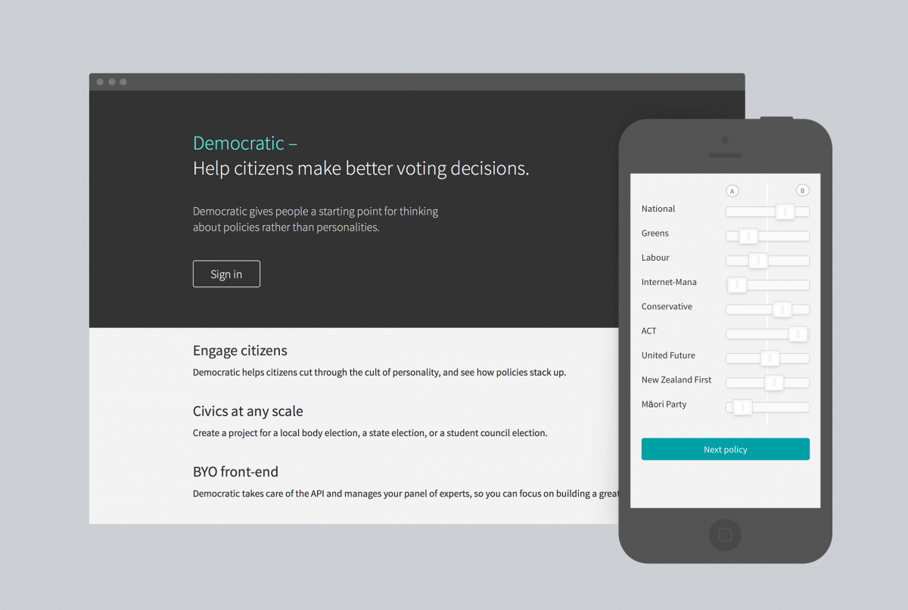

In 2011, a group of students from Massey’s College of Creative Arts came up with an idea to help educate young people about what party policies they most align with. They built a website called On The Fence in six days (on the seventh, they rested). In the days before the 2011 General Election, it netted 30,000 views and propelled the quintet to New Zealand–scale internet stardom. You can read about it [over here](http://www.stuff.co.nz/national/politics/campaign-trail/6017937/On-the-fence-about-voting). 

Karl Kane, the head of Massey’s [Design and Democracy project](http://designdemocracy.ac.nz/initiatives/on-the-fence), approached Springload earlier this year to collaborate on a new, improved version of On the Fence before this year's election. We jumped at the chance to work with this great research organisation on a project that matters to New Zealanders.

### Scaling down

Since the original On the Fence was released, mobile devices have saturated the landscape. We knew that this time we’d need to architect the app to work on any size screen, and a wider range of browsers – in 2011, Adobe Flash was the flavour of the day. For this incarnation, Ben and Gareth worked with project lead Kieran Stowers to set some new goals:

* Make it work on mobiles.
* Make it fast.
* Increase completions (many abandoned the previous game before completing all the questions).
* Maximise sharability.

We’ve hit these goals, with an average 7:48 mins spent on the site, 30,000 shares, and an 89% completion rate (Aug 2014).

### Scaling up

This is the nerdy bit.

Following the huge popularity of On the Fence version 1, we realised we would need to handle a high number of connections, without spending all of Massey’s research budget on infrastructure. We looked for something fast and light, and settled on a combination of new-kid-on-the-block Node.js with nginx (pronounced “engine-x”) on the front.

To make things even more rock-solid, Dave and I planned out a way to spread the work around. On the Fence is actually three applications. We’ll give you a quick tour:

#### 1. The game (we call it “frontend”)
The game you play when you hit “Get started” is a one-page web app built on Backbone Marionette. We’ve found this to be a great little framework – it works a treat on mobile devices. With six million+ clicks, swipes and pages visited, it’s doing a sterling job.

#### 2. onthefence.co.nz (we call this one “client”)
Client is a simple website with 9 URLs and a dozen functions. All up it’s about 300 lines of code. It serves up a few pages and makes funny sheep avatars that reflect a user’s political alignment (play On the Fence and you’ll see…). It also tosses information "over the fence" to:

#### 3. Democratic (“server”)
We realised early on that the brains behind On the Fence could be used for heaps of other elections in other democracies, where a sheep on a fence might not be an appropriate metaphor. With this in mind, we built a platform called “Democratic”, and set up On the Fence as a project. In Democratic, you create a project, add your Policy Areas and Candidates, then invite your panel of experts to rank each candidate on each policy area. We take care of all the user accounts, forgotten passwords and content management here.

It’s worked well, handling (at peak) 513 simultaneous users on an inexpensive cloud server without breaking a sweat. To date, the site has pulled in 140,000 visitors with over two million page views. Splitting things up makes it easy to test, tweak and deploy different parts of the site.

We’ve abstracted some of the handy bits of this setup into a little boilerplate you can use to kick-start your next Node.js project. [Check it out on Github](https://github.com/springload/SporeJS).

### High performance

Forty percent of mobile users abandon a site if it’s not loaded within three seconds ([here’s some proof](https://blog.kissmetrics.com/loading-time/%20)). We worked with Google’s Page Speed guidelines to ensure the absolute minimum CSS styles and JavaScript arrive at the browser first, while the bigger application loads sneakily in the background. We saw load times decrease from three seconds to under 200 ms with these optimisations. [Why page speed matters](https://developers.google.com/speed/docs/insights/about).

### Images
On the fence is mostly images. At last count, we had about a megabyte of detailed vector art (including a cut-scene and a full wardrobe of props for our sheep to wear). Kieran and I worked to balance the image detail against the loading times, haggling over the detail in the scenery and how many different props to load. It’s really important to set a [performance budget](http://cognition.happycog.com/article/designing-with-a-performance-budget) and stick with it.

To get all the images in the browser, we use Filament Group’s awesome Grunticon. Thomas [souped it up](https://github.com/springload/grunticon-pigment) to automagically make icons in different colours while being frugal on bandwidth (just sip, little unicorn…).

### Work different

This project has proved to be massively successful on multiple levels. It’s always more challenging when two separate organisations work together on a combined project, but in this case it’s worked brilliantly. It certainly helped that the team knew each other pretty well anyway (Ben, Mike and I have all previously studied at Massey).

We’ve taken care that our shared work environment has supported this project. We have hot-desked at each others’ offices, shared meals together and run design critiques with both our teams. It’s been extremely valuable working directly alongside the key decision makers, enabling us to work lean and ship something we’re all really proud of.

See the project at [onthefence.co.nz](http://onthefence.co.nz).

