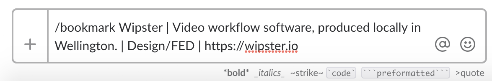
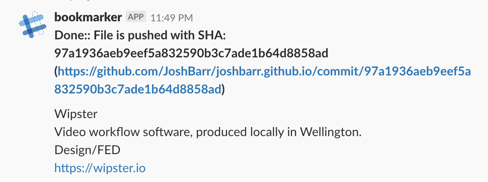
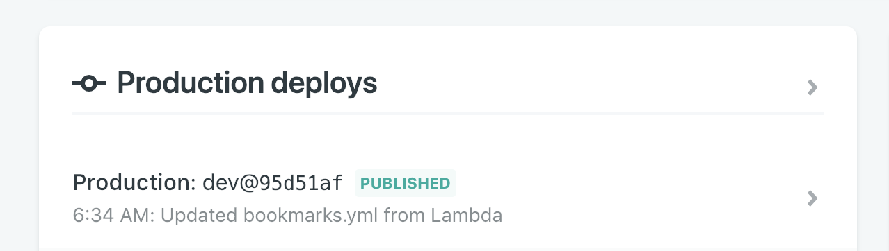
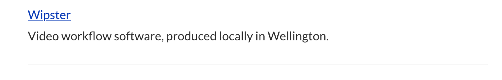

Bookmarking is often a very private activity, however I've got a lot out of reading other people's curated link collections. I wanted to devise a low-friction way to give back. 

Examining my habits, I realised that I had been using Slack as my bookmarking solution, sending links to myself in direct messages. However, as I have joined several Slack teams, keeping track of links across different teams has become impractical. While useful for my own reference, links in Slack are also difficult to share with anyone. 

I like the workflow of quickly dropping something in Slack (I've always got it open), but want my bookmarks persisted somewhere, with a description so I can remember why I bookmarked a particular thing. 

After a couple of hours tinkering, I've come up with an approach leveraging Slack Commands, AWS Lambda, and Netlify, to publish my bookmarks. Here's the high level architecture: 

### How it works

We start with a Slack command – `/bookmark` – that accepts Title, Description, Category and URL properties: 

The Slack command is pointing at a Lambda (deployed as a [Netlify](https://netlify.com/) function), which checks out my `bookmarks.yml` file, adds the new bookmark, and commits it back to Github. 

My static site is also hosted on Netlify, and is configured to deploy any time there's a commit to the `dev` branch.

This lets me quickly save a bookmark in Slack, and a minute or two later, it shows up on the [bookmarks](https://joshbarr.com/bookmarks) page: 

## Why I like this 

* All my data continues to live in source control, I don't need a query editor or a GUI to make changes to my bookmarks data.
* My bookmarks are public by default - no more risk of losing them in a Slack direct message.
* I'm [running less software](https://www.intercom.com/blog/run-less-software/), by outsourcing all the heavy-lifing to great platforms (Slack, Github, Netlify). 
